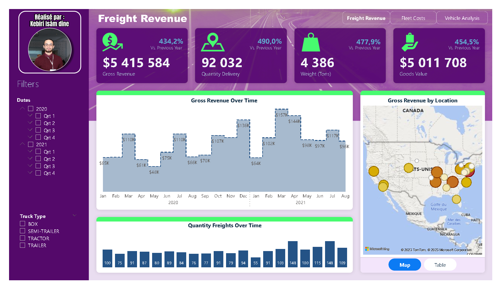
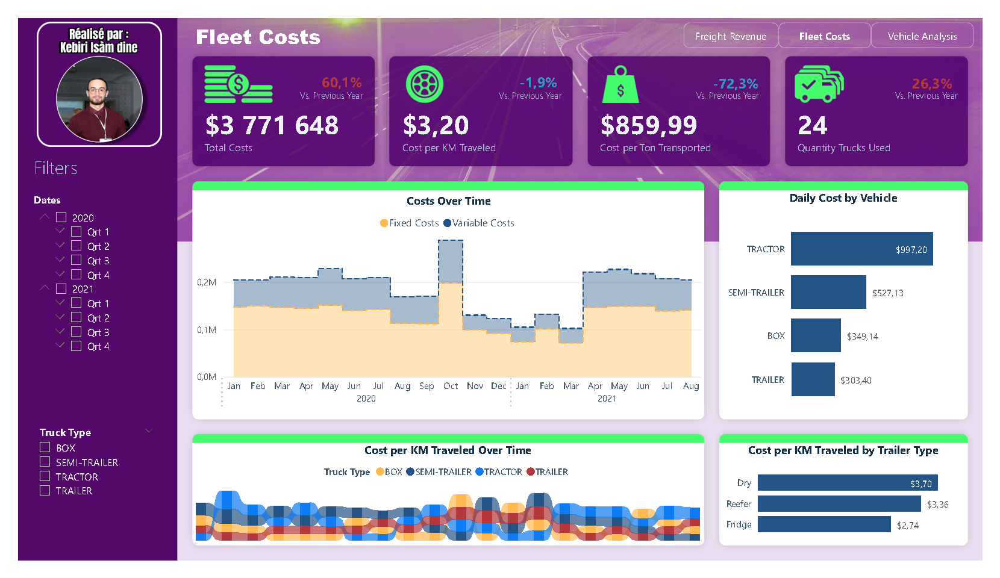
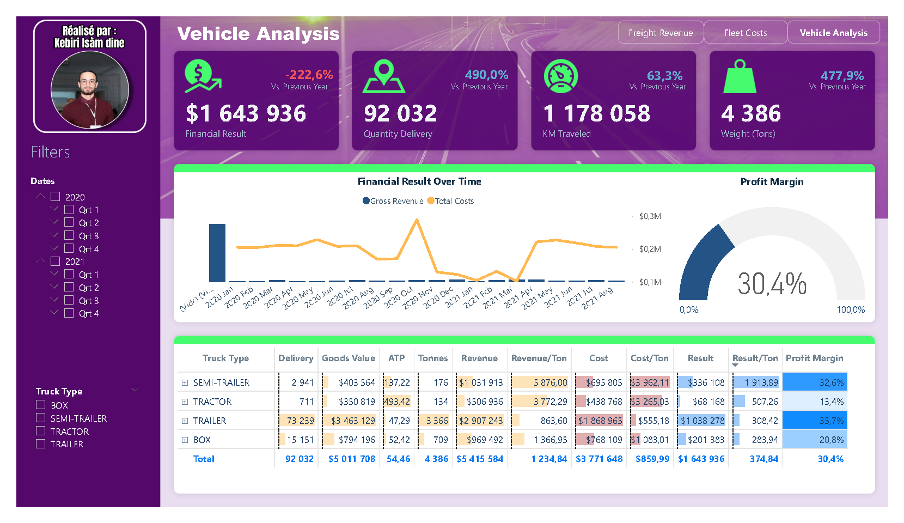

# Analyse et création de Dashboard des ventes de la société BEA

## About The Project

L'étude logistique réalisée dans Power BI (PBI) est une analyse approfondie des processus de gestion de la chaîne d'approvisionnement, de la distribution et de la gestion des ressources logistiques au sein d'une organisation. Cette étude vise à visualiser et à interpréter les données relatives aux opérations logistiques. À noter que les données ont été remplacées par de fausses données.

#### Fichiers de données :
- [_fFreight.csv](/Data/_fFreight.csv)
- [DimensionTables.xlsx](/Data/DimensionTables.xlsx)
- [fCosts.xlsx](/Data/fCosts.xlsx)
- [fFreight.csv](/Data/fFreight.csv)
- [fFreight.xlsx](/Data/fFreight.xlsx)

#### Built With

* PowerBI

## Result
[RESULT](Etude_logistique.pdf)

## License

[GPL-3.0](https://choosealicense.com/licenses/gpl-3.0/)

## Contact

📫 How to reach me: kebiri.isam.dine@gmail.com

🌐 My Portfolio: <https://kebiri-isam-dine.github.io/>

🔗 Project Link: [https://github.com/kebiri-isam-dine/PBI_Etude_logistique](https://github.com/kebiri-isam-dine/PBI_Etude_logistique)
